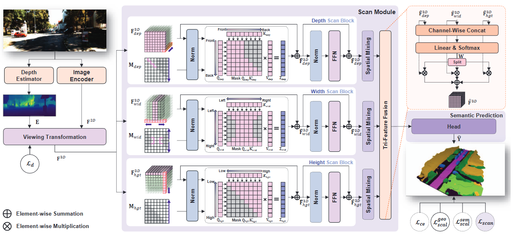
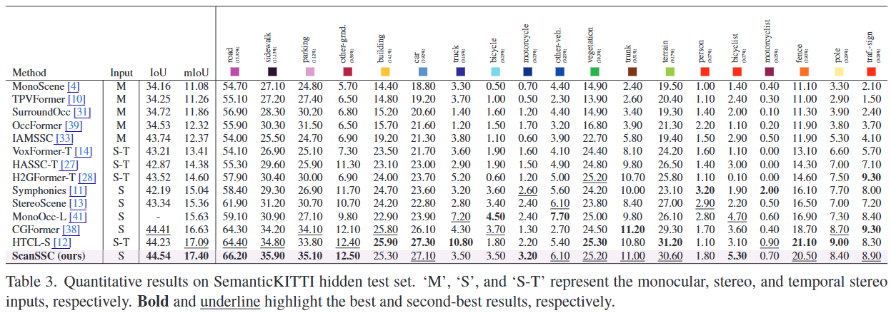
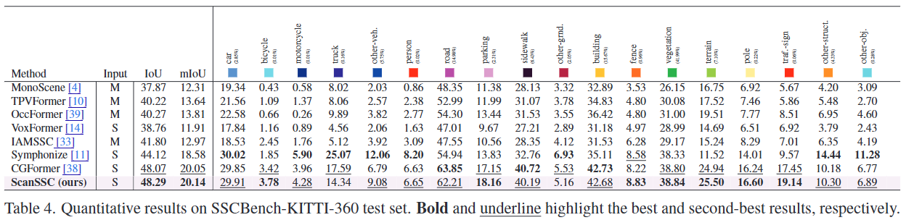

# Three Cars Approacing within 100m! Enhancing Distant Geometry by Tri-Axis Voxel Scanning for Camera-based Semantic Scene Completion

## News
---
- [2025/11/25] Code release
- [2025/02/27] Our paper has been accepted to CVPR2025!
- [2024/11/25] [**arxiv**](https://arxiv.org/abs/2411.16129) preprint released

## Introduction
Camera-based Semantic Scene Completion (SSC) is gaining attentions in the 3D perception field. However, properties such as perspective and occlusion lead to the underestimation of the geometry in distant regions, posing a critical issue for safety-focused autonomous driving systems. To tackle this, we propose ScanSSC, a novel camera-based SSC model composed of a Scan Module and Scan Loss, both designed to enhance distant scenes by leveraging context from near-viewpoint scenes. The Scan Module uses axis-wise masked attention, where each axis employing a near-to-far cascade masking that enables distant voxels to capture relationships with preceding voxels. In addition, the Scan Loss computes the cross-entropy along each axis between cumulative logits and corresponding class distributions in a near-to-far direction, thereby propagating rich context-aware signals to distant voxels. Leveraging the synergy between these components, ScanSSC achieves state-of-the-art performance, with IoUs of 44.54 and 48.29, and mIoUs of 17.40 and 20.14 on the SemanticKITTI and SSCBench-KITTI-360 benchmarks.

## Method



The overall architecture of the proposed ScanSSC. After $F^{3D}$ is obtained through the viewing transformation, it is passed through the three parallel Scan blocks of the Scan Module. Each block performs masked self-attention along the axis highlighted in red. The purple arrows indicate the 'near-to-far' direction, implemented by the corresponding mask below. $Q_{axis}, K_{axis}, V_{axis}$, and $Z_{axis}$ denote the query, key, value and output features of attention, respectively, where $axis\in\set{dep,wid,hgt}$.

## Quantitative Results





## Getting Started
### Install
ScanSSC is developed based on the official OccFormer & CGFormer codebased and the installation follows similar steps.

**1. Create a conda virtual environment and activate**

python 3.8 may not be supported

```shell
conda create -n ScanSSC python=3.7 -y
conda activate ScanSSC
```

**2. Install Pytorch and torchvision following the [official instructions](https://pytorch.org/get-started/previous-versions/)**

```shell
conda install pytorch==1.10.1 torchvision==0.11.2 torchaudio==0.10.1 cudatoolkit=11.3 -c pytorch -c conda-forge
```

or

```shell
pip install torch==1.10.1+cu113 torchvision==0.11.2+cu113 torchaudio==0.10.1 -f https://download.pytorch.org/whl/cu113/torch_stable.html
```

**3. Install mmcv, mmdet, and mmseg**

```shell
pip install openmim
mim install mmcv-full==1.4.0
mim install mmdet==2.14.0
mim install mmsegmentation==0.14.1
```

**4. Install mmdet3d 0.17.1 and DFA3D**

Compared with the offical version, the mmdetection3d provided by [OccFormer](https://github.com/zhangyp15/OccFormer) further includes operations like bev-pooling, voxel pooling. 

```shell
cd packages
bash setup.sh
cd ../
```

**5. Install other dependencies**

```shell
pip install -r docs/requirements.txt
pip install yapf==0.40.1
pip3 install natten==0.14.6+torch1101cu113 -f https://shi-labs.com/natten/wheels
```


## Model Performance
We provide the pretrained weight on SemanticKITTI and KITTI360 datasets, reproduced with the released codebase.
The pretrained checkpoint efficientnet-seg-depth can be download from [here](https://github.com/Ha-coding-user/ScanSSC/releases/download/tag/v1.0/pretrain_geodepth.pth).

|                           Dataset                            |    Backbone    |        IoU         |        mIoU        |                        Model Weights                         |
| :----------------------------------------------------------: | :------------: | :----------------: | :----------------: | :----------------------------------------------------------: |
| [SemanticKITTI](configs/semantickitti_ScanSSC.py) | EfficientNetB7 | 44.54 | 17.40 | [Link](https://github.com/Ha-coding-user/ScanSSC/releases/download/tag/v1.0/ScanSSC_SemanticKITTI.ckpt) |
|   [KITTI360](configs/kitti360_ScanSSC.py)    | EfficientNetB7 |       48.29        |       20.14        | [Link](https://github.com/Ha-coding-user/ScanSSC/releases/download/tag/v1.0/ScanSSC_KITTI360.ckpt) |

## Acknowledgement

Many thanks to these exceptional open source projects:
- [BEVFormer](https://github.com/fundamentalvision/BEVFormer)
- [mmdet3d](https://github.com/open-mmlab/mmdetection3d)
- [MonoScene](https://github.com/astra-vision/MonoScene)
- [semantic-kitti-api](https://github.com/PRBonn/semantic-kitti-api) 
- [MobileStereoNet](https://github.com/cogsys-tuebingen/mobilestereonet)
- [Symphonize](https://github.com/hustvl/Symphonies.git)
- [DFA3D](https://github.com/IDEA-Research/3D-deformable-attention.git)
- [VoxFormer](https://github.com/NVlabs/VoxFormer.git)
- [OccFormer](https://github.com/zhangyp15/OccFormer.git)
- [CGFormer](https://github.com/pkqbajng/CGFormer.git)

As it is not possible to list all the projects of the reference papers. If you find we leave out your repo, please contact us and we'll update the lists.

## Bibtex

If you find our work beneficial for your research, please consider citing our paper and give us a star:

```

@InProceedings{Bae_2025_CVPR,
    author    = {Bae, Jongseong and Ha, Junwoo and Kim, Ha Young},
    title     = {Three Cars Approaching within 100m! Enhancing Distant Geometry by Tri-Axis Voxel Scanning for Camera-based Semantic Scene Completion},
    booktitle = {Proceedings of the IEEE/CVF Conference on Computer Vision and Pattern Recognition (CVPR)},
    month     = {June},
    year      = {2025},
    pages     = {11939-11948}
}
```

If you encounter any issues, please contact gkwnsdn1130@gmail.com